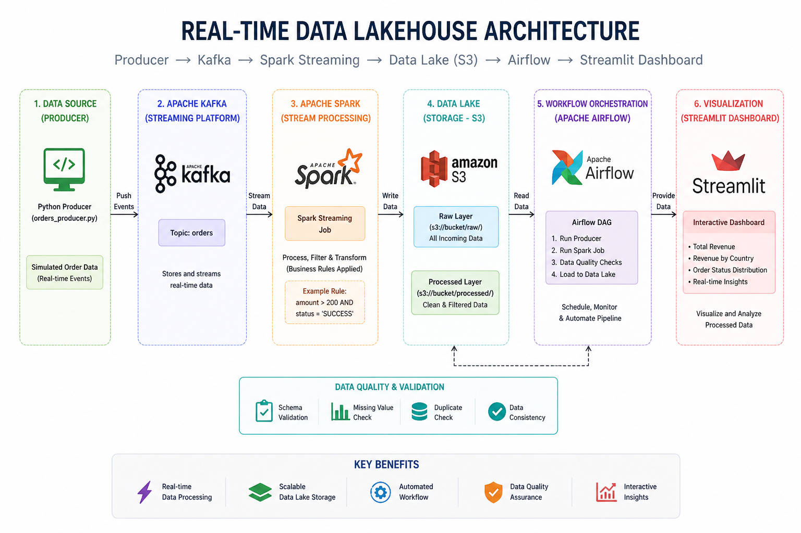

# 🚀 Real-Time Data Lakehouse Pipeline with Streaming & Streamlit

## 📌 Overview
This project implements a real-time data pipeline that ingests streaming data, processes it using Apache Spark, and stores it in a data lake. The processed data is visualized using an interactive Streamlit dashboard.

---

## 🚀 Live Project Highlights
- Real-time streaming pipeline using Kafka & Spark
- Data lake storage with raw and processed layers
- Automated workflows using Apache Airflow
- Interactive dashboard using Streamlit
- Batch-level data quality validation using Spark

---

## 🧩 Architecture

---

## 🎯 Problem Statement
Modern applications require real-time data processing to generate instant insights.  
This project simulates an e-commerce system that processes live order data to analyze revenue trends, transaction success rates, and country-wise performance.

---

## ⚙️ Tech Stack
- **Python**
- **Apache Kafka** – Real-time data ingestion  
- **Apache Spark (Structured Streaming)** – Data processing  
- **AWS S3** – Data lake storage  
- **Apache Airflow** – Workflow orchestration  
- **Streamlit** – Interactive dashboard  
- **Pandas / PyArrow** – Data handling  

---

## 🔄 Data Pipeline Flow
1. **Producer** generates real-time order data  
2. **Kafka** ingests streaming data  
3. **Spark Streaming** processes and filters data  
4. **Data Quality Checks** validate each batch  
5. **Data Lake (S3 / Local)** stores raw and processed data  
6. **Airflow** automates pipeline execution  
7. **Streamlit Dashboard** visualizes insights  

---

## 📂 Project Structure

data-lake-project/
│
├── producers/ # Kafka producer scripts
├── streaming/ # Spark streaming jobs
├── data_quality/ # Data validation checks
├── dags/ # Airflow DAGs
├── dashboard/ # Streamlit app
│ └── app.py
│
├── docs/
│ └── architecture.png
│
├── screenshots/
│ ├── 1_kafka_producer.png
│ ├── 2_spark_processing.png
│ ├── 3_data_storage.png
│ ├── 4_airflow_pipeline.png
│ └── 5_streamlit_dashboard.png
│
├── requirements.txt
├── README.md
└── .gitignore

--

## ▶️ How to Run

### 1️⃣ Start Kafka & Zookeeper

bin/zookeeper-server-start.sh config/zookeeper.properties
bin/kafka-server-start.sh config/server.properties

2️⃣ Create Topic
bin/kafka-topics.sh --create --topic orders --bootstrap-server localhost:9092

3️⃣ Run Producer
python producers/orders_producer.py

4️⃣ Run Spark Streaming
spark-submit streaming/spark_streaming.py

5️⃣ Run Airflow
airflow standalone

🌐 Run Streamlit Dashboard
streamlit run dashboard/app.py

🧪 Data Quality Validation
Invalid amount check (amount ≤ 0)
Null value detection
Batch-level validation using foreachBatch

🪣 Data Lake Design
Raw Layer → Stores incoming streaming data
Processed Layer → Stores filtered & cleaned data

📸 Project Workflow

📈 Sample Output
Total Revenue: 12000
India: 5000
USA: 7000
Success vs Failed Transactions

🎯 Use Case

This pipeline simulates an e-commerce analytics system to process real-time order data and generate actionable business insights.
